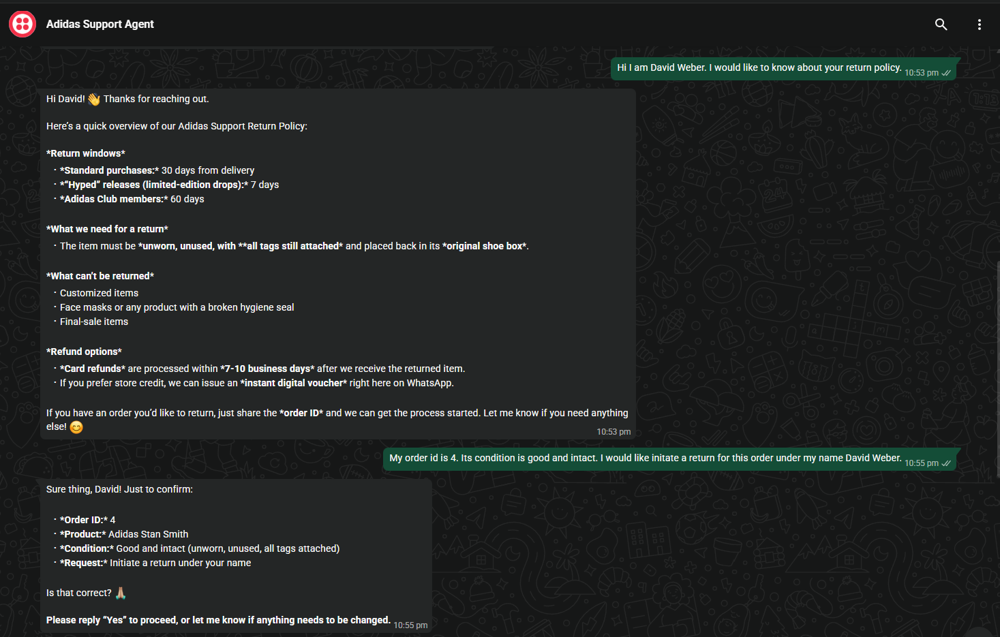

# Adidas Customer Support AI Agent

> Self-hosted n8n workflow that turns WhatsApp into an autonomous Adidas customer support agent using Twilio, Airtable, OpenAI, Docker, and ngrok.

This agentic AI workflow handles real customer support conversations over **WhatsApp** - answering return policy questions, tracking orders, booking support tickets, and processing return requests autonomously.

---

## What It Does

This agent connects directly to WhatsApp via Twilio and acts as a fully autonomous support agent for an Adidas store. Customers message in natural language and the agent intelligently handles:

| Capability | Description |
|---|---|
| Product Catalog | Answers questions about products - pricing, descriptions, most/least expensive |
| Return Policy | Explains return windows (30-day standard, 7-day hyped, 60-day Club), conditions and refund options |
| Return Requests | Collects order details, confirms with customer, creates ticket and issues prepaid label |
| Order Status | Looks up any order ID and reports current shipping status in real time |
| Support Tickets | Creates and logs tickets in Airtable for bad quality, wrong item, cancellations |

---

## Demo Screenshots

### 1. Product Catalog Query

Customer asks which products are most and least expensive. The agent queries the inventory and responds with full product details including price and description.


---

### 2. Return Policy + Return Request

Customer (David Weber) asks about the return policy. Agent explains all return windows, conditions, and refund options. Customer then provides Order ID 4 and requests a return - agent looks up the order and prepares a confirmation.



---

### 3. Return Request - Approved

Agent confirms the order details (Adidas Stan Smith, Order #4) and asks for customer approval. Customer replies Yes - agent instantly approves the return, explains next steps, and sends a prepaid return-shipping label with no human involvement.


---

### 4. Order Status Lookup

Customer (Clara Schmidt) asks for the status of Order #3. Agent looks it up and replies: Adidas NMD R1 is currently Shipped. Offers tracking link if needed.


---

### 5. Support Tickets - Airtable Database

Every conversation that needs follow-up automatically creates a tracked ticket in Airtable with issue type, notes, assignee, and status (Todo / In Progress / Done). 19 tickets shown across shipping, quality, returns, customisation and cancellation issues.


---

### 6. Bad Quality Complaint - Ticket + Prepaid Label

Customer reports receiving bad quality shoes. Agent collects order ID and eligibility details, verifies against return policy, creates a support ticket, and automatically generates a prepaid return shipping label link.


---

## Architecture

```
WhatsApp (Customer)
 |
 v
 Twilio (WhatsApp Webhook)
 |
 v
 n8n Webhook Trigger
 |
 v
 AI Agent (LLM - OpenAI)
 |-- Tool: Browse Product Catalog --> Inventory table (Airtable)
 |-- Tool: Get Return Policy --> Policy knowledge base
 |-- Tool: Check Order Status --> Orders table (Airtable)
 |-- Tool: Create Return Request --> Tickets table (Airtable)
 |-- Tool: Create Support Ticket --> Tickets table (Airtable)
 |
 v
 Twilio --> Reply to Customer on WhatsApp
```

---

## Tech Stack

| Tool | Role |
|---|---|
| [n8n](https://n8n.io) | Workflow automation engine (self-hosted via Docker) |
| [Twilio](https://twilio.com) | WhatsApp messaging API |
| [Airtable](https://airtable.com) | Orders, inventory and tickets database |
| OpenAI GPT | Natural language understanding and response generation |
| Docker | Self-hosted n8n deployment |
| ngrok | Expose local n8n to the internet for Twilio webhooks |

---

## How to Import and Run

### Prerequisites

- [Docker Desktop](https://www.docker.com/products/docker-desktop/) installed
- A [Twilio](https://twilio.com) account with a WhatsApp sandbox or production number
- An [Airtable](https://airtable.com) base with **Orders**, **Inventory**, and **Tickets** tables
- An OpenAI API key

### 1. Clone and Start n8n

```bash
git clone https://github.com/habeebb21/CustomerSupportAgent
cd CustomerSupportAgent
start.bat
```

`start.bat` launches n8n and ngrok inside Docker and prints your public webhook URL automatically - no manual URL copying or restarts needed.

### 2. Import the Workflow

1. Open n8n at `http://localhost:5678`
2. Go to **Workflows** and click **Import from file**
3. Select `workflow.json` from this repo
4. Add your credentials: Twilio, Airtable, OpenAI
5. Activate the workflow

### 3. Configure Twilio Webhook

1. Copy the public URL printed by `start.bat` (e.g. `https://xxxx.ngrok-free.app`)
2. In your [Twilio Console](https://console.twilio.com), set the WhatsApp incoming message webhook to that URL
3. Send a WhatsApp message to test

### 4. Set Up Airtable

Your Airtable base needs three tables. Sample CSV files are in the `resources used/` folder:

| Table | Key Columns |
|---|---|
| Orders | Order ID, Customer Name, Product, Status |
| Inventory | Product Name, Price, Description, Stock |
| Tickets | Issue, Notes, Assignee, Status |

---

## Sample Conversations

**Customer:** Hey, what is the most and least expensive product you have?
**Agent:** Most expensive: Adidas Tour360 - $200. Cheapest: Adidas Adilette Slides - $45.

**Customer:** Hi I am David Weber. I would like to know about your return policy.
**Agent:** Hi David! Return windows: 30 days standard, 7 days hyped drops, 60 days for Club members...

**Customer:** My order id is 4. I would like to initiate a return.
**Agent:** Just to confirm - Order #4, Adidas Stan Smith, good condition. Is that correct?
**Customer:** Yes
**Agent:** Return approved! Here is your prepaid return-shipping label.

**Customer:** Hi I am Clara Schmidt. Could you tell the status of order 3?
**Agent:** Hi Clara! Your order #3 (Adidas NMD R1) is currently Shipped.

**Customer:** I got bad shoe quality. I want to book a ticket.
**Agent:** Sorry to hear that. Share your order ID and confirm tags are attached - I will create a ticket and send a prepaid label.

---

## Project Structure

```
CustomerSupportAgent/
|-- workflow.json # n8n workflow - import this into n8n
|-- start.bat # One-click startup (n8n + public ngrok URL)
|-- stop.bat # Shutdown script
|-- start.ps1 # Startup automation logic
|-- docker-compose.yml # n8n + ngrok Docker Compose config
|-- backup.bat # One-click workflow backup
|-- screenshots/ # Demo screenshots (6 real WhatsApp conversations)
| |-- 01-product-catalog.png
| |-- 02-return-policy-and-request.png
| |-- 03-return-approved.png
| |-- 04-order-status.png
| |-- 05-ticket-database.png
| `-- 06-book-ticket-bad-quality.png
`-- resources used/ # Sample Airtable data (CSV)
 |-- Orders.csv
 |-- Inventory.csv
 `-- Tickets.csv
```

