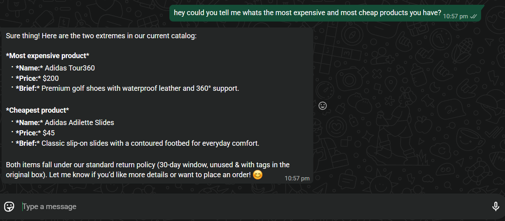
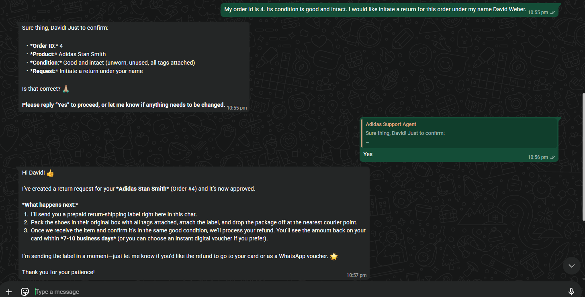
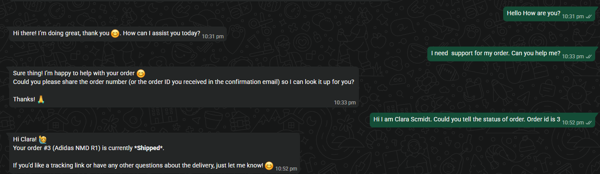
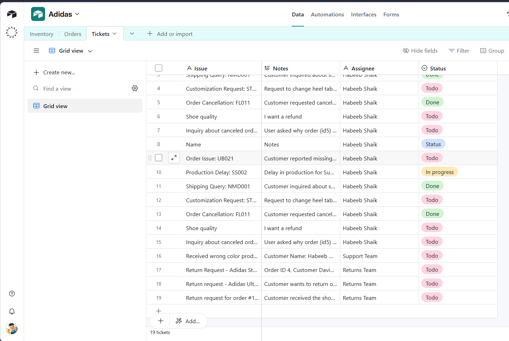
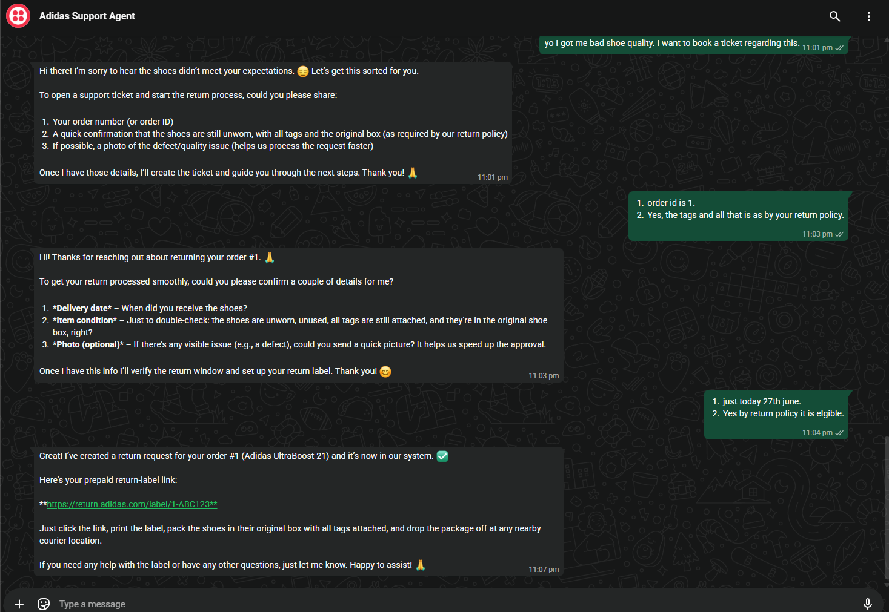

# Adidas Customer Support AI Agent

> An agentic AI workflow built with **n8n** that handles real customer support conversations over **WhatsApp** � answering return policy questions, tracking orders, booking support tickets, and processing return requests autonomously.

---

## What It Does

This agent connects directly to WhatsApp via Twilio and acts as a fully autonomous support agent for an Adidas store. Customers can message in natural language and the agent intelligently handles:

| Capability | Description |
|---|---|
| Return Policy | Explains return windows (30-day standard, 7-day hyped, 60-day Club), conditions, and refund options |
| Return Requests | Collects order details, confirms with customer, then creates return ticket and issues prepaid label |
| Order Status | Looks up any order ID and reports current shipping status in real time |
| Support Tickets | Creates and logs tickets in Airtable for issues like bad quality, wrong item, cancellations |
| Product Catalog | Answers questions about products � pricing, availability, descriptions |

---

## Demo Screenshots

### Return Policy Query

A customer asks about the return policy. The agent greets them by name, explains all return windows, conditions, and refund options � then offers to start a return immediately.



---

### Return Request � Confirmation Flow

Customer provides their order ID and requests a return. The agent looks up the order (Adidas Stan Smith, Order #4), summarises the details, and asks for confirmation before proceeding.


---

### Return Request � Approved

Customer confirms with Yes. The agent instantly approves the return, explains next steps, and sends a prepaid return-shipping label � all without any human involvement.



---

### Order Status Lookup

Customer asks for their order status. The agent identifies the order by ID and replies with the current shipping status (Adidas NMD R1 � Shipped).



---

### Support Ticket � Airtable Database

Every conversation that requires follow-up automatically creates a tracked ticket in Airtable with issue type, notes, assignee, and status (Todo / In Progress / Done).



---

### Booking a Ticket � Bad Quality Report

Customer reports receiving a bad quality product. The agent walks them through the return process, verifies eligibility against the return policy, and generates a prepaid shipping label link automatically.



---

## Architecture

```
WhatsApp (Customer)
 |
 v
 Twilio (WhatsApp Webhook)
 |
 v
 n8n Webhook Trigger
 |
 v
 AI Agent (LLM)
 |-- Tool: Check Order Status --> Orders table (Airtable)
 |-- Tool: Create Return Request --> Tickets table (Airtable)
 |-- Tool: Get Return Policy --> Policy knowledge base
 |-- Tool: Browse Product Catalog --> Inventory table (Airtable)
 |-- Tool: Create Support Ticket --> Tickets table (Airtable)
 |
 v
 Twilio --> Reply to Customer on WhatsApp
```

---

## Tech Stack

| Tool | Role |
|---|---|
| [n8n](https://n8n.io) | Workflow automation engine (self-hosted) |
| [Twilio](https://twilio.com) | WhatsApp messaging API |
| [Airtable](https://airtable.com) | Orders, inventory and tickets database |
| OpenAI GPT | Natural language understanding and response generation |
| Docker | Self-hosted n8n deployment |
| ngrok | Expose local n8n to the internet for webhooks |

---

## How to Import and Run

### Prerequisites

- [Docker Desktop](https://www.docker.com/products/docker-desktop/) installed
- A [Twilio](https://twilio.com) account with a WhatsApp sandbox or production number
- An [Airtable](https://airtable.com) base with **Orders**, **Inventory**, and **Tickets** tables
- An OpenAI API key

### 1. Clone and Start n8n

```bash
git clone https://github.com/habeebb21/CustomerSupportAgent
cd CustomerSupportAgent
start.bat
```

The `start.bat` launches n8n and ngrok inside Docker and prints your public webhook URL automatically � no manual URL copying needed.

### 2. Import the Workflow

1. Open n8n at `http://localhost:5678`
2. Go to **Workflows** and click **Import from file**
3. Select `workflow.json` from this repo
4. Add your credentials � Twilio, Airtable, OpenAI
5. Activate the workflow

### 3. Configure Twilio Webhook

1. Copy the public URL printed by `start.bat` (e.g. `https://xxxx.ngrok-free.app`)
2. In your [Twilio Console](https://console.twilio.com), paste it as the incoming message webhook for your WhatsApp number
3. Send a WhatsApp message to test

### 4. Set Up Airtable

Your Airtable base needs three tables. Sample CSV files are included in the `resources used/` folder:

| Table | Key Columns |
|---|---|
| Orders | Order ID, Customer Name, Product, Status |
| Inventory | Product Name, Price, Description, Stock |
| Tickets | Issue, Notes, Assignee, Status |

---

## Sample Conversations

**Customer:** Hi I am David Weber. I would like to know about your return policy.
**Agent:** Hi David! Here is a quick overview of our return policy... *(explains full policy with return windows, conditions, refund options)*

**Customer:** My order id is 4. I would like to initiate a return.
**Agent:** Sure thing! Just to confirm � Order #4, Adidas Stan Smith, good condition. Is that correct?
**Customer:** Yes
**Agent:** Return approved! Here is your prepaid return-shipping label.

**Customer:** Hi I am Clara Schmidt. Could you tell the status of order 3?
**Agent:** Hi Clara! Your order #3 (Adidas NMD R1) is currently *Shipped*.

**Customer:** Yo I got bad shoe quality. I want to book a ticket.
**Agent:** I am sorry to hear that. Could you share your order ID and confirm the item is unworn with all tags? *(collects details, creates ticket, sends prepaid label)*

---

## Project Structure

```
CustomerSupportAgent/
|-- workflow.json # n8n workflow � import this into n8n
|-- start.bat # One-click startup (n8n + public ngrok URL)
|-- stop.bat # Shutdown script
|-- start.ps1 # Startup automation logic
|-- docker-compose.yml # n8n + ngrok Docker Compose config
|-- backup.bat # One-click workflow backup
|-- screenshots/ # Demo screenshots
|-- resources used/ # Sample Airtable data (CSV files)
 |-- Orders.csv
 |-- Inventory.csv
 `-- Tickets.csv
```

---

## About

Built by **Habeeb Shaik** as part of an Agentic AI internship application.

This project demonstrates:
- End-to-end agentic workflow design using n8n
- Multi-tool AI agent with real-world integrations (WhatsApp, Airtable, Twilio)
- Autonomous customer support � return policy, order tracking, ticket creation, return processing
- Self-hosted, production-deployable architecture with Docker and ngrok

---

## License

MIT
